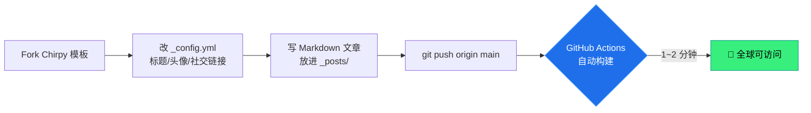

> 你正在看的这篇文章，就是这个博客的第一篇。而这个博客本身，是我用一个下午、外加一个 AI 助手搭起来的。这篇文章记录了整个过程——包括中间那个让我一度怀疑人生的、**文章凭空消失**的诡异 bug。
{: .prompt-tip }

## 先说结论：搭一个博客，没那么可怕

如果你也想拥有一个属于自己的、干净清爽、还能写代码高亮的博客，但一想到「服务器」「域名」「数据库」就头大——好消息：**这些你一个都不需要**。

这个站点用的是这套组合：

| 组件 | 选择 | 花了多少钱 |
|------|------|-----------|
| 静态网站生成器 | [Jekyll](https://jekyllrb.com/) | ¥0 |
| 主题 | [Chirpy](https://github.com/cotes2020/jekyll-theme-chirpy) | ¥0 |
| 托管 + 部署 | GitHub Pages + Actions | ¥0 |
| 域名 | `username.github.io` 免费二级域名 | ¥0 |
| **合计** | | **¥0** |

没错，全程零成本。你写 Markdown，`git push` 一下，几分钟后全世界就能访问。

## 整个流程长这样

我把从零到上线的过程画成了一张图：



看起来很顺对吧？前面确实顺。直到我写完第一篇文章、信心满满地推送上线、打开网站准备截图炫耀的那一刻——

## 然后，文章消失了

**首页空空如也。** 点进文章链接，`404`。分类页、标签页，全是空的。

可我的文章明明已经 commit、已经 push、GitHub 上清清楚楚躺着那个 `.md` 文件啊？

我盯着屏幕，脑子里闪过一万种可能：构建失败了？路径错了？主题坏了？缓存问题？……一个个排查，全都不是。

最后揪出真凶的，是这张图：

{: w="960" h="420" .shadow }
_真相只有一个：时间。_

## 真相：我给文章写了一个「未来」的发布时间

文章的元信息（Front Matter）里有一行：

```yaml
date: 2026-06-30 20:00:00 +0800
```

而我推送的时候，是**下午**。也就是说，这篇文章的「发布时间」被我设到了**几个小时后的未来**。

而 Jekyll 有一个默认行为：

> `future: false` —— 发布时间晚于「当前构建时刻」的文章，会被直接跳过、不予构建。
{: .prompt-warning }

于是 GitHub Actions 构建网站的那一刻，Jekyll 看了一眼这篇「来自未来」的文章，礼貌地说了句「还没到点呢」，然后把它**晾在了一边**。首页、分类、标签自然全都聚合不到它——因为在已发布的世界里，它根本不存在。

修复方法简单到好笑——把时间改成不晚于现在：

```diff
- date: 2026-06-30 20:00:00 +0800
+ date: 2026-06-30 14:30:00 +0800
```

再 `git push`，等一两分钟，文章稳稳当当回来了。🎉

> 这个坑的隐蔽之处在于：它**不报错**。构建是「成功」的，只是悄悄少了一篇文章。如果你也遇到「文章死活不显示、但又没有任何报错」，第一个就该怀疑日期。
{: .prompt-danger }

## 顺手总结：Chirpy 写文章的几条规矩

踩完坑，我把 Chirpy 写文章的规范也摸清了，记在这儿，给未来的自己（和你）省点事：

1. **文件命名**：放进 `_posts/`，名字必须是 `YYYY-MM-DD-标题.md`。
2. **日期别写未来**：`date` 带上时区（如 `+0800`），且不晚于当前——血泪教训。
3. **分类最多两级**：`categories: [一级, 二级]`，顺序是「父 → 子」。
4. **标签随意但建议小写**：`tags: [jekyll, chirpy]`，数量不限。
5. **图片**：放 `assets/img/`，用 `{: w="700" h="400" }`，还能加 `.shadow` 阴影。
6. **提示框是灵魂**：`tip` / `info` / `warning` / `danger` 四种，就是本文里这些彩色块。

一个最小可用的文章头长这样：

```yaml
---
title: 我的文章标题
date: 2026-06-30 14:30:00 +0800
categories: [技术, 建站]
tags: [jekyll, chirpy]
---

正文从这里开始……
```

## 写在最后

回头看，搭这个博客最难的部分，既不是配置也不是部署，而是那个**不报错的未来日期**——它提醒我：很多时候系统没坏，只是我们对它的默认行为一无所知。

而这，大概也是值得写下来的第一篇博客该有的样子：不是教程的复读，而是一个真实踩过的坑、和爬出来的过程。

如果你看到这里——欢迎来到我的博客。后面还有更多。👋

> 下一篇想看点什么？欢迎在评论区告诉我。
{: .prompt-info }
